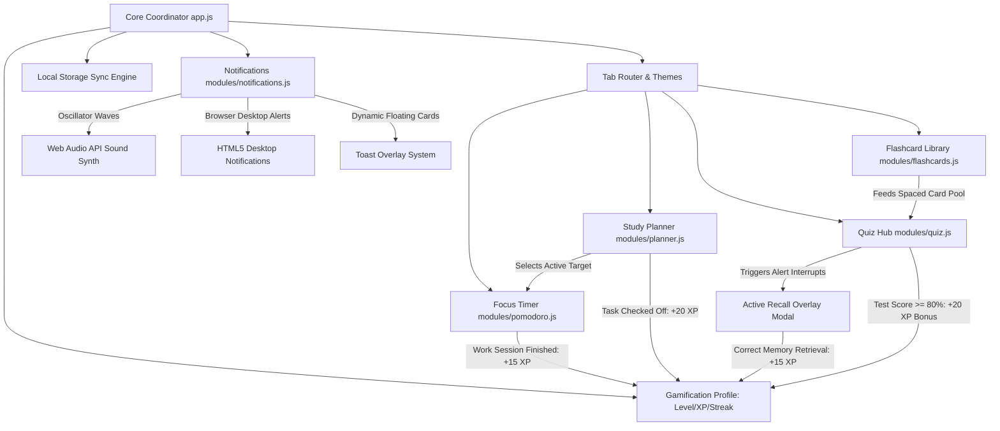

# AetherStudy — Study Planner & Focus Dashboard

AetherStudy is a premium, game-like single-page dashboard application built with a modern glassmorphism aesthetic for students to organize tasks, maintain focus, and practice active recall.

---

## 🗺️ System Architecture Flow Diagram

The following architecture flowchart illustrates how the modular JavaScript files coordinate task state, timer controls,spaced repetition pools, notification services, and the gamified level/XP storage engine:



---

## 🔄 Core App Workflow

Here is the step-by-step cycle of how a student uses AetherStudy:

```
[1. Plan Tasks] ──> [2. Set Focus Target] ──> [3. Run Pomodoro] 
                                                    │
[6. Level Up] <── [5. Answer Pop-ups] <── [4. Active Recall Alert]
```

1. **Plan & Schedule**: The user inputs study tasks in the **Study Planner** and schedules them into hourly daily schedule blocks (8:00 AM - 8:00 PM).
2. **Link Focus Target**: In the **Focus Timer**, the user selects a task from the active planner pool.
3. **Engage Deep Focus**: The Pomodoro timer starts. The circular progress ring drains. When the timer finishes, a programmatically synthesized bell sound rings, a desktop notification fires, and the user receives `+15 XP`.
4. **Active Recall Interrupts**: While studying, the background loop triggers an **Active Recall popup** at chosen intervals (e.g. every 15 minutes), displaying a random flashcard question or quiz.
5. **Score & Progress**: Answering correctly awards the user `+15 XP`. Failing prompts them with the correct answer to study.
6. **Mastery Review**: The user opens the **Flashcard Decks** to flip cards (3D card flip) and flags them as *Easy* or *Hard* to customize review frequencies.

---

## 📖 Detailed Guide & Features

### 1. Study Planner (`modules/planner.js`)
- **Interactive Daily Grid**: A 12-hour timetable to organize tasks. To schedule, edit a task and select a time block. 
- **Sorting & Filters**: Sort tasks by Status (*Todo, In Progress, Completed*) and priority (*High, Medium, Low*). 
- **XP Reward**: Checking off a task awards `+20 XP` to your profile level.

### 2. Focus Timer (`modules/pomodoro.js`)
- **SVG Path Manipulation**: Leverages trigonometric circular geometry (`2 * PI * r`) to render a smooth countdown ring.
- **Cycle Settings**: Work session (25 mins), Short break (5 mins), and Long break (15 mins) durations can be customized in the Settings panel.
- **Streak & Stats Logs**: Displays focus blocks completed today and active focus duration.

### 3. Spaced-Repetition Flashcards (`modules/flashcards.js`)
- **3D Card Flip Transform**: Uses CSS 3D transform perspectives (`transform-style: preserve-3d; transform: rotateY(180deg)`) for smooth card flips.
- **Grading Mechanics**: Flag cards as *Easy (Mastered)* to update deck completion charts, or *Hard (Study Again)* to re-add them to the Spaced Repetition queue.

### 4. Quiz Hub & Alert Popups (`modules/quiz.js`)
- **Question Compiler**: Supports compiling Multiple Choice Questions (MCQs) and Short Text questions.
- **Active Recall Engine**: Periodically fetches random questions from the flashcard and quiz databases to prompt you, fighting the psychological "forgetting curve".
- **Dynamic Configuration**: Change recall popup intervals from 1 minute (for fast testing) to 60 minutes.

### 5. Synthesized Alert Sound System (`modules/notifications.js`)
- **Web Audio API Synth**: Avoids loading external audio assets by dynamically creating pitch chime oscillators programmatically:
  - *Timer Complete*: Metallic bell chime using staggered C5-E5-G5-C6 sine waves.
  - *Correct Answer*: Tri-tone rising note configuration.
  - *Incorrect Answer*: Descending sawtooth pitch-bend frequency.

---

## 🚀 Installation & Running

### Local Hosting (Zero Config)
Because the codebase uses clean modular namespaces rather than ES Modules, you do not need to run a server to open the files. 

1. Double-click the [index.html](file:///e:/Capstone%20project/index.html) file to open the dashboard immediately.

### Run over local HTTP Server (Recommended)
If you prefer running the code over an HTTP port, run this in your terminal inside the project directory:
```powershell
# Using Node.js http-server
npx http-server -p 8080
```
Then navigate to: `http://localhost:8080` in your web browser.
